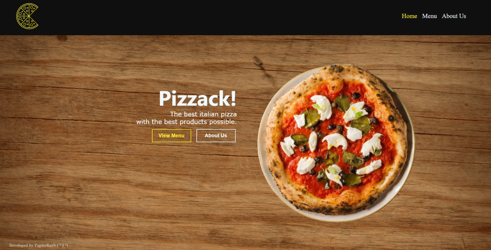

### Pizzack! Pizzeria Website

# This is a Restaurant Web Page for a fictional pizzeria in my city.

This project was completed for The Odin Project Javascript Restaurant Page Assignment. The aim of the project was to make a functional multi page Restaurant website using WebPack to bundle files.

## Built With
- Webpack
- Vanilla JS
- CSS3
- HTML5

## Live Demo
[a link](https://pages.github.com/)

## Improvements

Features we are going to add to this app:

- Responsive Web Design
- Website with React JS Framework
- Better Images

## Usage
Once you are on the Home Page, you have three links in the navbar

- Home: To return to the Home Page
- Menu: A small fraction of the pizzas in our restaurant
- About: What our pizza website 

## Show your support

Hit the star button and support me :)

